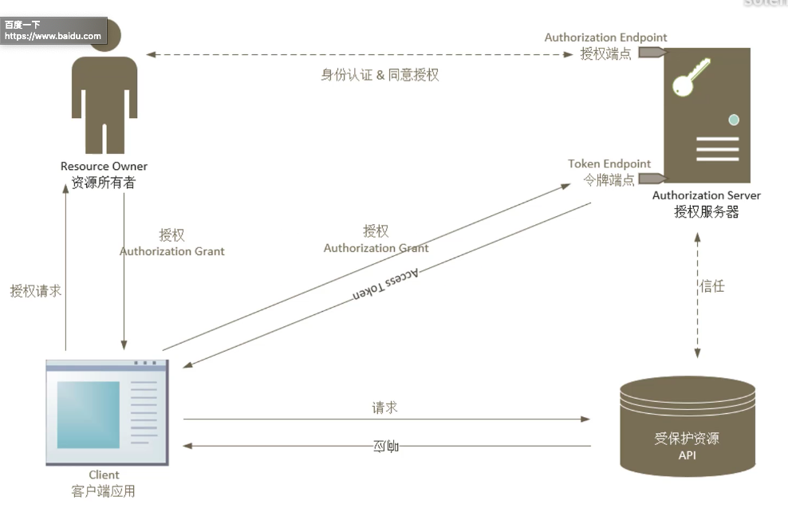

# 
Identity Server 4

## 课程简介
* OAuth 2.0简介
* Openid Connect简介
* Identity Server 4应用实例
  * ASP.NET Core MVC客户端
  * ASP.NET Core Web API资源
  * Angular客户端
  * WPF客户端
  * Nodejs(express)/Python(Flask)客户端/资源
  * Server to Server
  * ...

### 什么是OAuth 2.0？
* OAuth 2.0是一个委托协议，它可以让那些控制资源的人允许某个应用以代表他们来访问他们控制的资源，注意是代表这些人，而不是假冒或模仿这些人。这个应用从资源的所有者哪里获得到<b>授权</b>(Authorization)和access token，随后就可以使用这个access token来访问资源。

* 关于授权Authorization
* Access Token
* 支持各种客户端应用S

## 授权和认证
* OAuth 2.0 授权 Authorization
  * 你能干什么
* OpenId Connect 身份认证 Authentication
  * 你是谁

## Identity Server 4
* Oauth 2.0
* OpenId Connect

## OAuth 2.0

## 授权服务器 Authorization Server

## 授权服务器做总结流程图

## 授权类型 Authorization Grant
* Authorization Code
* Implicit
* Resource Owner Password Credentials
* Client Credentials
* Device Code
* Device Code
* Refresh Token

## 端点Endpoint
* Authorization Endpoint，授权端点
* Token Endpoint，Token端点

## 范围Scope
* 代表资源所有者在被保护资源哪里的一些权限。

## Access Token
* 有时候就叫做Token
* 用来访问被保护的资源的凭据
* 代表了给客户端颁发的授权，也就是委托给客户端的权限
* 描述出scope，有效期

## Refresh Token
* 用来获取Access Token的凭据
* 由Authorization Server颁发给客户端应用的
* 可选
* 具备让客户端应用逐渐降低访问权限的能力

## 发生错误时
* error
* error—_description
* erro_uri
* state
* Authorization Endpoint
  * https://xxxx.xxx.xx//authorize?error=invalidation
* Token Endpoint
  * ....在body里

## 错误类型
* invalid_request
* invalid_client(401)
* invalid_grand
* unauthorized_client
* unsupported_grant_type
* invalid_scope

# 
OpenID Connect 协议简介

## OpenID Connect
* OAuth 2.0 不是身份认证协议
* 什么是身份认证？
  * 它可以告诉应用程序当前的用户是谁，还有这些用户是否正在使用你的应用程序。它是一种安全架构，它可以告诉你用户是他们所声明的身份，通常呢，是通过提供一套安全凭据(例如用户名和密码)给应用程序来证明这一点。

## 身份认证VS授权
* 身份认证Authentication
* 授权Authorization

* 要制作巧克力软糖，也就是需要一个基于OAuth 2.0 的身份认证协议。而OpenID Connect就是这样的开放标准，它可以工作于不同的身份供应商之间，OpenID Connect基于OAuth2.0，在此之上，它添加了一些组件来提供身份认证的能力。
* OpenID Conncet的官方定义是：OpenID Connect是建立在OAuth 2.0协议上的一个简单的身份标识层，OpenID Connect兼容OAuth 2.0。

## OAuth 2.0 与身份认证协议的角色映射

