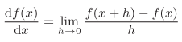

# <center>深度学习入门：基于Python的理论与实践</center>

@author Shine.Lee \
@created 2021-6-6 18:34

# 第一章 Python入门
略。
# 第二章 感知机

感知机是一种算法。1957年美国学者Frank Rosenblatt提出来的。感知机是神经网络（深度学习）的起源算法。

学习感知机的构造也就是学习通向神经网络的和深度学习的一种重要思想。


> 2.1 感知机是什么？

感知机接收多个输入信号，输出一个信号。

感知机的多个输入信号都有各自固有的权重，这些权重发挥着控制各个信号的重要性的作用。也就是说，权重越大，对应该权重的信号的重要性就越高。

神经元会计算传送过来的信号的总和，只有当这个总和超过了某个界限值时，才会输出1。这也称为“神经元被激活”。

这里将这个界限值称为阈值θ。

> 2.2 简单逻辑电路

> 2.2.1 与门

| x1  | x2  | y   |
| --- | --- | --- |
| 0   | 0   | 0   |
| 1   | 0   | 0   |
| 0   | 1   | 0   |
| 1   | 1   | 1   |

> 2.2.2 与非门和或门

| x1  | x2  | y   |
| --- | --- | --- |
| 0   | 0   | 1   |
| 1   | 0   | 1   |
| 0   | 1   | 1   |
| 1   | 1   | 0   |

把与门的参数值的符号取反，就可以实现与非门。

| x1  | x2  | y   |
| --- | --- | --- |
| 0   | 0   | 0   |
| 1   | 0   | 1   |
| 0   | 1   | 1   |
| 1   | 1   | 1   |


> 2.3 感知机的实现

> 2.3.1 简单的实现

``` python
def AND(x1, x2):
    w1, w2, theta = 0.5, 0.5, 0.7
    tmp = x1*w1 + x2*w2
    if tmp <= theta:
        return 0
    elif tmp > theta:
        return 1
```
``` python
AND(0, 0) # 输出0
AND(1, 0) # 输出0
AND(0, 1) # 输出0
AND(1, 1) # 输出1
```

> 2.3.2 导入权重和偏置

把阈值θ换成偏置-b

> 2.3.3 使用权重和偏置的实现

``` python
def AND(x1, x2):
    x = np.array([x1, x2])
    w = np.array([0.5, 0.5])
    b = -0.7
    tmp = np.sum(w*x) + b
    if tmp <= 0:
        return 0
    else:
        return 1
```

> 2.4 感知机的局限性

使用感知机可以实现与门、与非门、或门三种逻辑电路。现在我们来考虑一下异或门（XOR gate）。

> 2.4.1 异或门

仅当x1或x2中的一方为1时，才会输出1。

| x1  | x2  | y   |
| --- | --- | --- |
| 0   | 0   | 0   |
| 1   | 0   | 1   |
| 0   | 1   | 1   |
| 1   | 1   | 0   |

感知机是无法实现这个异或门的。

> 2.4.2 线性和非线性

感知机的局限性就在于它只能表示由一条直线分割的空间。

由曲线分割而成的空间称为非线性空间，由直线分割而成的空间称为线性空间。

> 2.5 多层感知机

感知机的绝妙之处在于它可以“叠加层”来表示异或门。

> 2.5.1 已有门电路的组合

`s1`代表非的输出结果。

`s2`代表或的输出结果。

| x1  | x2  | s1  | s2  | y   |
| --- | --- | --- | --- | --- |
| 0   | 0   | 1   | 0   | 0   |
| 1   | 0   | 1   | 1   | 1   |
| 0   | 1   | 1   | 1   | 1   |
| 1   | 1   | 0   | 1   | 0   |

异或

> 2.5.2 异或门的实现

``` python
def XOR(x1, x2):
    s1 = NAND(x1, x2)
    s2 = OR(x1, x2)
    y = AND(s1, s2)
    return y
```

``` python 
XOR(0, 0) # 输出0
XOR(1, 0) # 输出1
XOR(0, 1) # 输出1
XOR(1, 1) # 输出0
```

异或门是多层感知机。

x层感知机，一共有x层权重，就称x层感知机。

> 2.6 从与非门到计算机

感知机通过叠加层能够进行非线性的表示，理论上还可以表示计算机进行的处理。

> 2.7 小结

* 感知机是具有输入和输出的算法。给定一个输入后，将输出一个既定的值。
* 感知机将权重和偏置设定为参数。
* 使用感知机可以表示与门和或门等逻辑电路。
* 异或门无法通过单层感知机来表示。
* 使用2层感知机可以表示异或门。
* 单层感知机只能表示线性空间，而多层感知机可以表示非线性空间。
* 多层感知机（在理论上）可以表示计算机。

# 第三章 神经网络

对于上一章来说，对于复杂的函数，感知机也隐含着能够表示它的可能性。但是，设定权重的工作，只能由人工进行。

神经网络的出现，就可以自动地从数据中学习到合适的权重参数。

> 3.1 从感知机到神经网络

神经网络和上一章介绍的感知机有很多共同点。这里，我们主要以两者的差异为中心，来介绍神经网络的结构。

> 3.1.1 神经网络的例子

中间层有时也成为隐藏层。

> 3.1.2 复习感知机

```
    ┍ 0 (b + w1x1 + w2x2) <= 0
y = │
    └ 1 (b + w1x1 + w2x2) > 0
```

y=h(b+w1x1+w2x2)

> 3.1.3 激活函数登场

h(x)函数会将输入信号的总和转换为输出信号，这种函数一般称为激活函数。

激活函数的作用在于决定如何来激活输入信号的总和。

激活函数是连接感知机和神经网络的桥梁。

> 3.2 激活函数

阶跃函数是指一旦输出超过阈值，就切换输出的函数。

感知机使用了阶跃函数作为激活函数。

如果将激活函数从阶跃函数换成其他函数，就可以进入神经网络的世界了。

> 3.2.1 sigmoid函数

神经网络中经常使用的一个激活函数就是sigmoid函数。

h(x) = 1/(1+exp(-x))

* exp(-x)表示以e为底的-x次幂。

感知机和神经网络的主要区别就在于这个激活函数。

> 3.2.2 阶跃函数的实现

``` python
def step_function(x):
    if x > 0:
        return 1
    else:
        return 0
```

参数x只能接受实数（浮点数），为了后面的操作，我们把它修改为支持NumPy数组的实现。

``` python
def step_function(x):
    y = x > 0
    return y.astype(np.int)
```

astype()方法转换Numpy数组的类型。

> 3.2.3 阶跃函数的图形

``` python
import numpy as npm
import matplotlib.pylab as plt

def step_function(x):
    return np.array(x > 0, dtype = np.int)

x = np.arange(-5.0, 5.0, 0.1)
y = step_function(x)
plt.plot(x, y)
plt.ylim(-0.1, 1.1) # 指定y轴的范围
plt.show()
```

np.arange(-5.0, 5.0, 0.1)代表范围从-5.0到5.0，单位为0.1生成Numpy数组。


> 3.2.4 sigmoid函数的实现

``` python
def sigmoid(x):
    return 1 / (1 + np.exp(-x))
```
x为Numpy数组时，结果也能正确计算。
之所以sigmoid支持Numpy数组功能，秘密在于Numpy的广播功能。

* sigmoid函数的图形

``` python 
x = np.arrange(-5.0, 5.0, 0.1)
y = sigmoid(x)
plt.plot(x, y)
plt.ylim(-0.1, 1.1)
plt.show()
```

> 3.2.5 sigmoid函数和阶跃函数的比较

不同点

* 平滑性不同。sigmoid函数比较平滑，阶跃函数以0为界，输出发生急剧变化。
  * sigmoid函数的平滑对神经网络的学习有重要意义。
* 返回值范围不同。阶跃函数只能返回0和1，而sigmoid函数能返回0.731、0.880等实数。
  * 也就是说，感知机神经元之间流动的是二元信号，神经网络中流动的是连接的实数值信号。

共同点

* 输入小数时，都接近0；输出大数时，都接近1。
* 无论输入多大多小的数都在0-1之间。

> 3.2.6 非线性函数

阶跃函数和sigmoid函数还有一个其他的共同点，就是它们都是非线性函数。

sigmoid函数是一条曲线，阶跃函数是像阶梯一样的折线。两者都是非线性函数。

* 线性：是指量与量之间按比例，成直线的关系。输出值是输入值常数倍的函数叫做线性函数。eg. h(x)=cx

* 神经网络的激活函数必须使用非线性函数。
* 如果使用线性函数的话，加深神经网络的层数就没有意义了。

* eg. 激活函数为h(x) = cx
  * y(x) = h(h(h(x)))；相当于 y(x) = c * c * c * x
  * 可以直接写成 y(x) = ax；a为c的立方

> 3.2.7 ReLU函数

在神经网络发展的历史上，sigmoid函数很早就被使用了。而最近则主要使用ReLU（Rectified Linear Unit）函数。

ReLU函数在输入大于0时，直接输出该值；在输入小于等于0时，输出0。

```
    ┍ x (x > 0)
y = │
    └ 0 (x <= 0)
```

ReLU实现

``` python
def relu():
    return np.maximum(0, x)
```

np.maximum()就是max函数，挑大的输出。

> 3.3 多维数组的运算
掌握Numpy多维数组的运算，就可以高效地实现神经网络。

> 3.3.1 多维数组

多维数组就是“数字的集合”。

``` python
>>> import numpy as np
>>> A = np.array([1, 2, 3, 4])
>>> print(A)
[1 2 3 4]
>>> np.ndim(A)
1
>>> A.shape
(4,)
>>> A.shape[0]
4
```

* 数组的维数，可以通过np.dim()获得。
* 数组的形状可以通过shape获得。
* A.shape获得的结果是一个元组（tuple）。

下面生成一个二维数组:
``` python
>>> B = np.array([[1,2], [3,4], [5,6]])
>>> print(B)
[[1 2]
 [3 4]
 [5 6]]
>>> np.ndim(B)
2
>>> B.shape
(3, 2)
```

二维数组也成为矩阵（matrix）。

> 3.3.2 矩阵乘法

在Numpy中np.dot(A, B)方法为矩阵的乘法。

矩阵的 A * B 和 B * A 的结果可能不同。

* 线代的知识，什么情况可乘，什么情况不可乘。

> 3.3.3 神经网络的内积


> 3.4 三层神经网络的实现


3层神经网络：输入层（第0层）有2个神经元，第1个隐藏层（第1层）有3个神经元，第2个隐藏层（第2层）有2个神经元，输出层（第3层）有2个神经元

> 3.4.1 符号确认


> 3.4.2 各层间信号传递的实现


<center>式3-9</center>

用Numpy来实现 式3-9
``` python
X = np.array([1.0, 0.5])
W1 = np.array([[0.1, 0.3, 0.5], [0.2, 0.4, 0.6]])
B1 = np.array([0.1, 0.2, 0.3])
print(W1.shape) # (2, 3)
print(X.shape) # (2,)
print(B1.shape) # (3,)
A1 = np.dot(X, W1) + B1
```

输出层的激活函数用σ()表示，不同于隐藏层的激活函数h()。

> 3.4.3 代码实现小结

``` python
def init_network():
    network = {}
    network['W1'] = np.array([[0.1, 0.3, 0.5], [0.2, 0.4, 0.6]])
    network['b1'] = np.array([0.1, 0.2, 0.3])
    network['W2'] = np.array([[0.1, 0.4], [0.2, 0.5], [0.3, 0.6]])
    network['b2'] = np.array([0.1, 0.2])
    network['W3'] = np.array([[0.1, 0.3], [0.2, 0.4]])
    network['b3'] = np.array([0.1, 0.2])
    return network

def forward(network, x):
    W1, W2, W3 = network['W1'], network['W2'], network['W3']
    b1, b2, b3 = network['b1'], network['b2'], network['b3']
    a1 = np.dot(x, W1) + b1
    z1 = sigmoid(a1)
    a2 = np.dot(z1, W2) + b2
    z2 = sigmoid(a2)
    a3 = np.dot(z2, W3) + b3
    y = identity_function(a3)
    return y

network = init_network()
x = np.array([1.0, 0.5])
y = forward(network, x)
print(y) # [ 0.31682708 0.69627909]
```

init_network()函数会进行权重和偏置的初始化，并将它们保存在字典变量network中。这个字典变量network中保存了每一层所需的参数（权重和偏置）。forward()函数中则封装了将输入信号转换为输出信号的处理过程。

> 3.5 输出层的设计

神经网络可以用在分类问题和回归问题上，不过需要根据情况改变输出层的激活函数。一般而言，回归问题用恒等函数，分类问题用softmax函数。

* 机器学习的问题大致可以分为分类问题和回归问题。分类问题是数据属于哪一个类别的问题。比如，区分图像中的人是男性还是女性的问题就是分类问题。而回归问题是根据某个输入预测一个（连续的）数值的问题。比如，根据一个人的图像预测这个人的体重的问题就是回归问题（类似“57.4kg”这样的预测）。

> 3.5.1 恒等函数和softmax函数

* 恒等函数会将输入按原样输出，对于输入的信息，不加以任何改动地直接输出。因此，在输出层使用恒等函数时，输入信号会原封不动地被输出。

* softmax函数


softmax函数定义
``` python
def softmax(a):
    exp_a = np.exp(a)
    sum_exp_a = np.sum(exp_a)
    y = exp_a / sum_exp_a
    return y
```

> 3.5.2 实现softmax函数时的注意事项

* 计算机计算时面临溢出问题。（比如计算e的1000次幂时，会出现无限大inf）

softmax函数的实现可以像下面这样进行改进。


* 分子分数同乘常数C，结果不发生改变。
* 把log C换成C'
* 在softmax函数中，加减常数不影响结果的改变。
* C'可以是任意值。一般会使用输入信号中的最大值。

softmax溢出对策函数定义
``` python
def softmax(a):
    c = np.max(a)
    exp_a = np.exp(a - c) # 溢出对策
    sum_exp_a = np.sum(exp_a)
    y = exp_a / sum_exp_a
    return y
```

> 3.5.3 softmax函数的特征

* softmax函数输出的是0.0到0.1之间的数
* softmax函数输出数字的总和等于1
* softmax输出可以解释为“概率”

> 3.5.4 输入层的神经元数量

输出层的神经元数量需要根据待解决的问题来决定。对于分类问题，输出层的神经元数量一般设定为类别的数量。

> 3.6 手写数字识别

假设学习已经全部结束，我们使用学习到的参数，先实现神经网络的“推理处理”。这个推理处理也称为神经网络的前向传播（forward propagation）。

* 和求解机器学习问题的步骤（分成学习和推理两个阶段进行）一样，使用神经网络解决问题时，也需要首先使用训练数据（学习数据）进行权重参数的学习；进行推理时，使用刚才学习到的参数，对输入数据进行分类。

> 3.6.1 MNIST数据集

* MNIST是机器学习领域最有名的数据集之一。论文时通常被用作实验数据。
* MNIST是由0-9的数字图像构成。训练图像有6万张，测试图像有1万张。
* MNIST图像数据是由28*28像素的灰度图像(1通道)。各像素取值在0-255之间。每个图像数据都相应的标有7、2、1等标签。

可以用下列方式导入

``` python
import sys, os
sys.path.append(os.pardir) # 为了导入父目录中的文件而进行的设定
from dataset.mnist import load_mnist
# 第一次调用会花费几分钟 ……
(x_train, t_train), (x_test, t_test) = load_mnist(flatten=True,
normalize=False)
# 输出各个数据的形状
print(x_train.shape) # (60000, 784)
print(t_train.shape) # (60000,)
print(x_test.shape) # (10000, 784)
print(t_test.shape) # (10000,)
```
显示MNIST图像
``` python
import sys, os
sys.path.append(os.pardir)
import numpy as np
from dataset.mnist import load_mnist
from PIL import Image
def img_show(img):
 pil_img = Image.fromarray(np.uint8(img))
 pil_img.show()
(x_train, t_train), (x_test, t_test) = load_mnist(flatten=True,
normalize=False)
img = x_train[0]
label = t_train[0]
print(label) # 5
print(img.shape) # (784,)
img = img.reshape(28, 28) # 把图像的形状变成原来的尺寸
print(img.shape) # (28, 28)
img_show(img)
```

> 3.6.2 神经网络的推理处理

下面我们对MNIST数据集进行神经网络推理

* 神经网络的输入层有784个神经元。源于图像大小28*28=784。
* 输出层有10个神经元。数字类别0-9，共10个。
* 神经网络有2个隐藏层。
* 第一个隐藏层有50个神经元。第二个隐藏层有100个神经元。50和100可以设置任何值。
* 下面我们设置三个函数。get_data(); init_network(); predict()

``` python
def get_data():
    (x_train, t_train), (x_test, t_test) = \
    load_mnist(normalize=True, flatten=True, one_hot_label=False)
    return x_test, t_  test

def init_network():
    with open("sample_weight.pkl", 'rb') as f:
    network = pickle.load(f)
    return network

def predict(network, x):
    W1, W2, W3 = network['W1'], network['W2'], network['W3']
    b1, b2, b3 = network['b1'], network['b2'], network['b3']
    a1 = np.dot(x, W1) + b1
    z1 = sigmoid(a1)
    a2 = np.dot(z1, W2) + b2
    z2 = sigmoid(a2)
    a3 = np.dot(z2, W3) + b3
    y = softmax(a3)
    return y
```

* init_network()会读入保存在pickle文件sample_weight.pkl中的学习到的
权重参数A。


> 3.6.3 批处理

> 3.7 小结


# 第四章 神经网络的学习

* 这里的“学习”是指在训练数据过程中自动获取最优权重的过程。
* 本章将导入损失函数这一指标。
* 目的：以该损失函数为基准，找出能使它的值达到最小的权重参数。
* 我们将用到函数斜率的梯度法。

> 4.1 从数据中学习

* 神经网络的特征就是可以从数据中学习。
* 所谓“从数据中学习”，是指可以由数据自动决定权重参数的值。
* 减少人工。因为实际的神经网络中，参数可能成千上万。层数更深的深度学习中，参数可以上亿。
* 本章介绍 利用数据决定参数值的方法。
* 并用Python实现对MNIST手写数据集学习的实际。

> 4.1.1 数据驱动

* 数据是机器学习的核心。
* 机器学习方法极力避免人为介入。尝试从数据中得到答案。
* 神经网络或深度学习则比以往的机器学习方法更能避免人为介入。

思考一个具体的问题：识别手写数字5的程序。
* 这个是一个很难的程序。
* 人可以很简单的识别5，但确很难说出是基于哪种规律。

我们可以通过有效利用数据来解决这个问题。
* 先从图像中提取特征量，再用机器学习技术学习这些特征量的模式。
* 这里的说的“特征量”是指从输入数据中准确地提出本质数据的转换器。
* 图像的特征量通常表示为向量的形式。
* 在计算机视觉的领域，常用的特征量包括SIFT、SURF和HOG等。使用这些特征量将数据转换为向量，然后对转换后的向量使用机器学习中的SVM、KNN等分类器进行学习。
* 需要人为选择合适的特征量。

tips：
* 深度学习有时也称为端到端机器学习(end-to-end machine learning).

神经网络的优点是对所有问题都可以用相同的流程来解决。

> 4.1.2 训练数据和测试数据

* 机器学习中，一般分为训练数据和实验数据两部分来进行学习和实验。
* 首先，使用训练数据进行学习，寻找最优的参数。
* 然后，使用测试数据评价训练得到的模型的实际能力。
* 分为两种，是因为我们追求的是模型的泛化能力。
* 训练数据也成为监督数据。
* 泛化能力是指处理未被观察过的数据的能力。
* 获得泛化能力是指机器学习的目标。
* 仅用一个数据集去学习和评价参数是无法进行评价的。

by the way

* 只对某个数据集过度拟合的状态称为过拟合。
* 避免过拟合也是机器学习的一个重要课题。

> 4.2 损失函数

* 神经网络的学习通过某个指标表示现在的状态。然后以这个指标为基准，寻找最优权重参数。
* 神经网络中所用的这个指标就叫做损失函数。
* 神经网络的学习中的指标称为损失函数。这个损失函数可以使用任意函数，但一般用均方误差和交叉熵误差等。

tips:
* 损失函数是表示神经网络性能的“恶劣程度”的指标，即当前神经网络对监督数据在多大程度上不拟合，在多大程度上不一致。

> 4.2.1 均方误差

可以用作损失函数的函数有很多，其中最有名的是均方误差。


* yk表示神经网络的输出
* tk表示监督数据
* k表示数据的维度

用python实现
``` python
def mean_squared_error(y, t):
    return 0.5 * np.sum((y-t)**2)
```

> 4.2.2 交叉熵误差

除了均方误差之外，交叉熵误差也经常被用作损失函数。


* log表示以e为底数的自然对数（log）
* yk是神经网络的输出
* tk是正确解标签
* 式4-2实际上只计算对应正确解标签的输出的自然对数

用代码实现交叉熵误差

``` python
def cross_entropy_error(y, t):
    delta = le - 7
    return -np.sum(t * np.log(y + delta))
```

> 4.2.3 mini-batch学习

机器学习使用训练数据进行学习，严格来说就是针对训练数据计算损失函数的值，找出使该值尽可能小的参数。

损失函数只针对一个数据，当有成千上万个数据时，计算损失函数是不现实的。因此我们选出一小部分，称为mini-batch。在用这小批量进行学习。

> 4.2.4 mini-batch版交叉熵误差的实现

``` python
def cross_entropy_error(y, t):
    if y.ndim == 1:
        t = t.reshape(1, t.size)
        y = y.reshape(1, y.size)

    batch_size = y.shape[0]
    return -np.sum(t * np.log(y + le-7)) / batch_size
```

> 4.2.5 为何要设定损失函数

在进行神经网络的学习时，不能将识别精度作为指标。因为如果以识别精度为指标，则参数的导数在绝大多数地方都会变为0。

> 4.3 数值微分

梯度法使用梯度的信息决定前进的方向。

> 4.3.1 导数

导数就是某个瞬间的变化量。



程序实现：
``` python
def numerical_diff(f, x):
    h = 10e-50
    return (f(x+h) - f(x)) / h
```

> 4.3.2 数值微分的例子

> 4.3.3 偏导数

> 4.4 梯度

像（x偏导，y偏导）这样的由全部变量的偏导数汇总而成的向量成为梯度。

梯度是一个向量，由方向。

用代码实现：
``` python
def numerical_gradient(f, x):
    h = 1e-4 # 0.0001
    grad = np.zeros_like(x) # 生成和x形状相同的数组
    for idx in range(x.size):
    tmp_val = x[idx]
    # f(x+h)的计算
    x[idx] = tmp_val + h
    fxh1 = f(x)
    # f(x-h)的计算
    x[idx] = tmp_val - h
    fxh2 = f(x)
    grad[idx] = (fxh1 - fxh2) / (2*h)
    x[idx] = tmp_val # 还原值
    return grad
```

> 4.4.1 梯度法

机器学习的主要任务是在学习时寻找最优参数。同样地，神经网络也必须在学习时找到最优参数（权重和偏置）。这里所说的最优参数是指损失函数取3最小值时的参数。

我们可以通过梯度法来查找损失函数的最小值。

梯度表示的是各点处的函数值减小最多的方向。而不是，指向的一定是最小值方向。

tips:

* 函数的极小值、最小值以及被称为**鞍点**的地方，梯度为0。
* 鞍点是从某个方向看上去是极大值，另一个方向看上去是极小值。

> 4.4.2 神经网络的梯度

> 4.5 学习算法的实现

神经网络的学习步骤

* **前提**

神经网络存在合适的权重和偏置，调整权重和偏置以便拟合训练数据的过程称为“学习”。神经网络的学习分成下面4个步骤。

* **步骤1（mini-batch）**

从训练数据中随机选出一部分数据，这部分数据称为mini-batch。我们的目标是减小mini-batch的损失函数的值。

* **步骤2（计算梯度）**

为了减小mini-batch的损失函数的值，需要求出各个权重参数的梯度。梯度表示损失函数的值减小最多的方向。

* **步骤3（更新参数）**

将权重参数沿梯度方向进行微小更新

* **步骤4（重复）**

重复步骤1、步骤2、步骤3